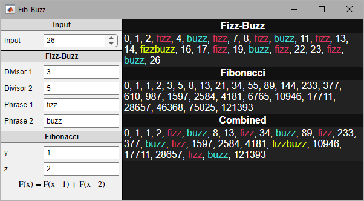

# Fib-Buzz

Contains stand-alone functions for fizz-buzz and Fibonacci sequence processing as well as an application to process user inputs and display results. The application automatically regenerates and displays results for each of the algorithms and applies styling with HTML/CSS.

## Files

### FibBuzz.mlapp

GUI that accepts user inputs for fizz-buzz and Fibonacci algorithms.

Can be run through MATLAB console by running
`FibBuzz` or `FibBuzz(x)` where `x` is the sequence length for either fizz-buzz or Fibonacci.

### Fibonacci.m
Produces the Fibonacci sequence for a given sequence length `x` and function call offsets `y` and `z`.
`F(0)` and `F(1)` are seeded with 0 and 1, respectively.

Can be run stand-alone by running `sequence = Fibonacci(x, y, z)`, where `x` represents the sequence length (the sequence ending with the `x`th value), `y` is the first offset (`F(x - y)`), and `z` is the second offset (`F(x -z)`).

### FizzBuzz.m
Processes a sequence of values and replaces entries with provided phrases when they are divisible by specified user-inputs.

Can be run stand-alone by running `resultString = FizzBuzz(input, divisor1, divisor2, phrase1, phrase2)`.

### MapFizBuzzCallback.m
Maps callbacks from FibBuzz.mlapp into a more review-friendly format and handles input validation error checking.

Not meant to be run standalone.
